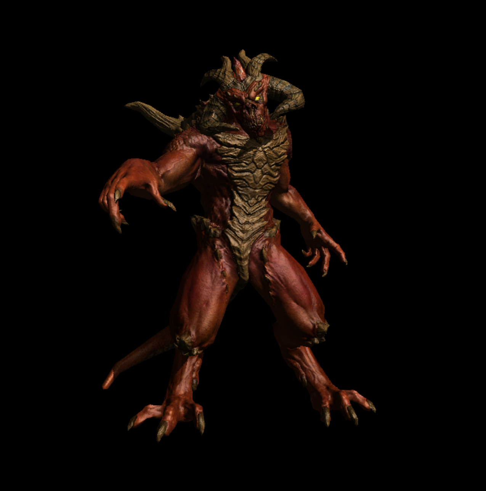
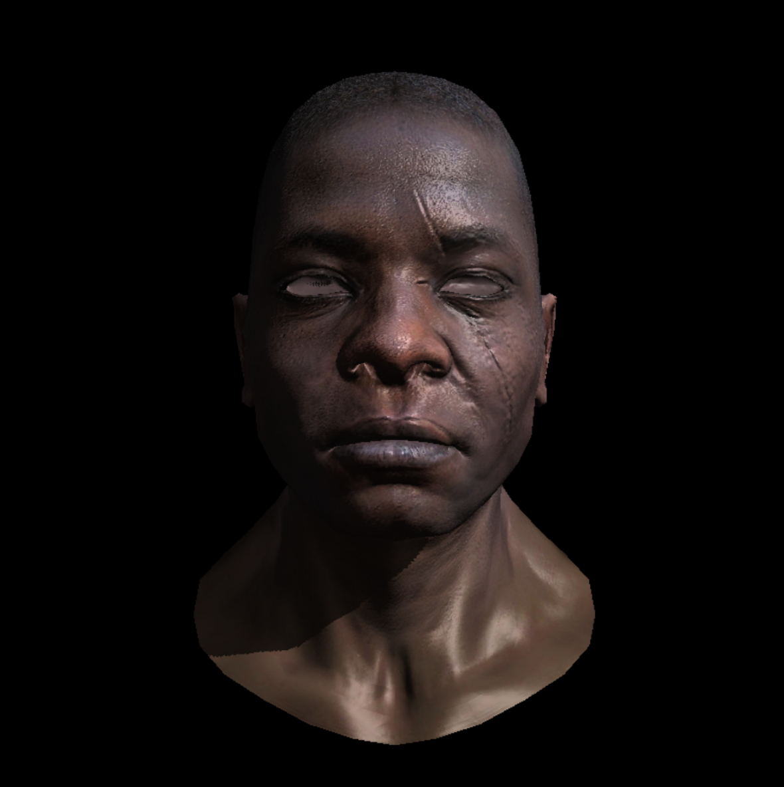
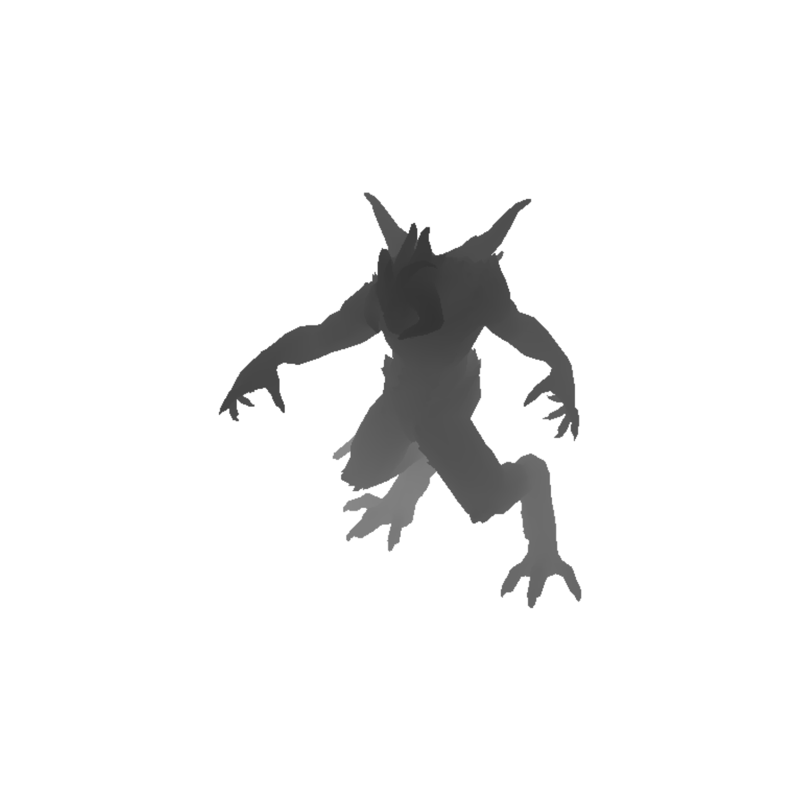
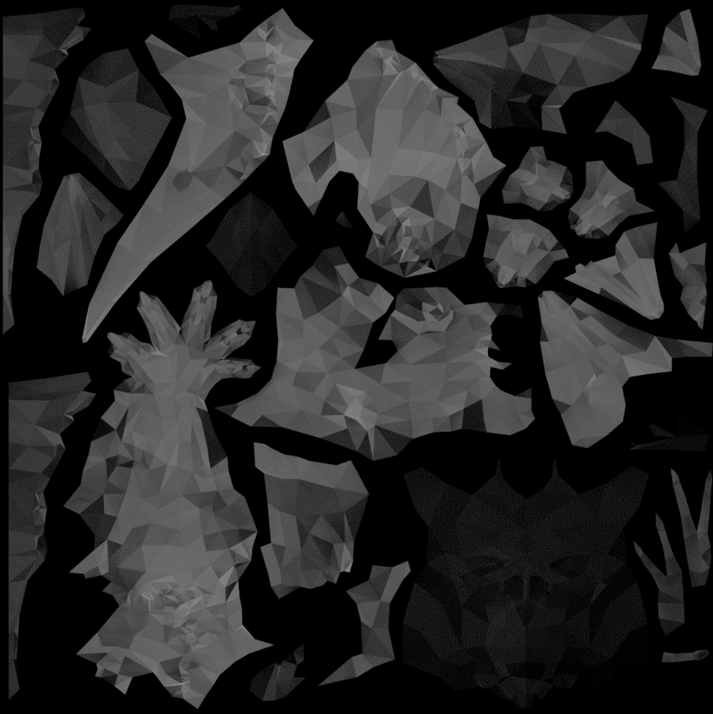
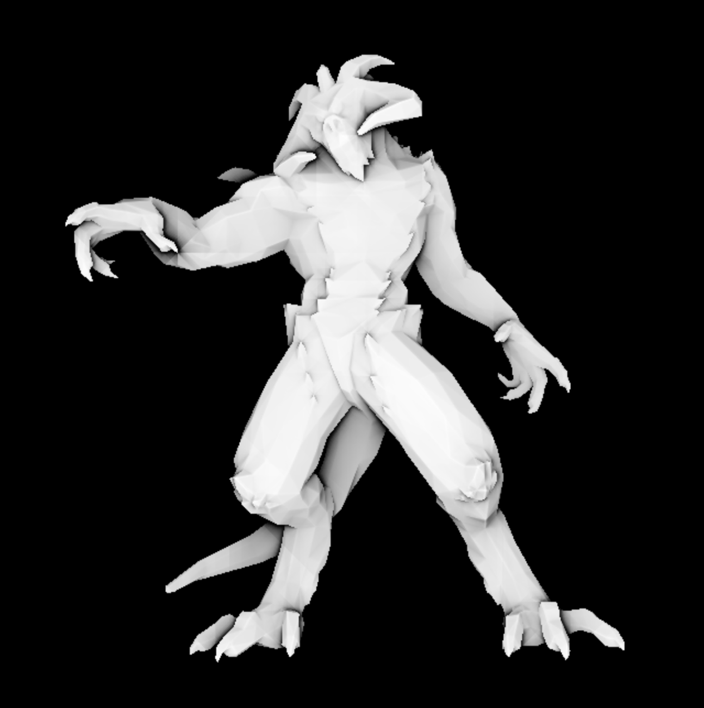

# SoftRenderer
SoftRenderer is a software rasterization application written from scratch in C++17 with minimal dependencies (except win32 for display image) for windows platform. 
The purpose of writing this renderer is mainly for better understanding basic CG knowledge and algorithms.

Currently only support Platform Windows
## Blinn-Phong Shading

## shadow mapping

## Ao Texture baking

## SSAO

## Main Features
- Minimal dependencies
- Homogeneous clipping
- Perspective correct interpolation
- Depth testing
- Blinn-Phong shading
- Shadow mapping
- Tangent space normal mapping
- Ambient occlusion
- Moveable camera

## TODO
- [ ] Physically based rendering (PBR)
- [ ] Metallic-roughness workflow
- [ ] Image-based lighting (IBL)
- [ ] Cubemapped skybox